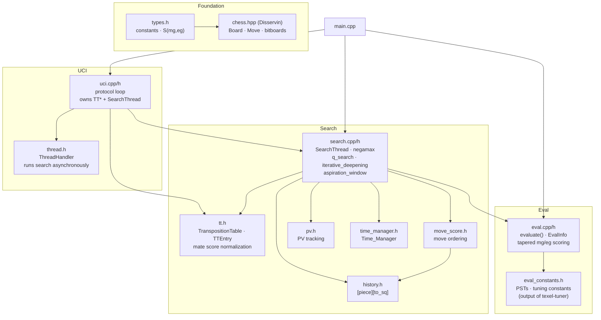
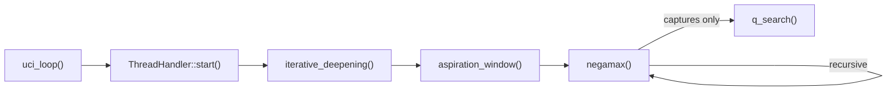

# CLAUDE.md

This file provides guidance to Claude Code (claude.ai/code) when working with code in this repository.

## What This Is

Lux is a UCI-compatible chess engine written in C++. It implements alpha-beta negamax search with iterative deepening, a transposition table, quiescence search, and a handcrafted evaluation function with piece-square tables.

For OpenBench and texel-tuner setup, see the workspace-level `CLAUDE.md` one directory up.

## Build Commands

From the repo root (`Lux/`):

```bash
make dev       # dev build with warnings-as-errors → src/executables/Lux.exe
make release   # optimized release build (multiple CPU variants)
make EXE=Lux   # OpenBench-compatible build (default target)
```

**Build flag note:** `-flto` is intentionally absent from all targets — it changes move ordering via inlining, producing different node counts than OpenBench worker builds.

## Running / Debugging

Run the binary and type UCI commands:
```
uci
isready
position startpos
go depth 10
```

Non-UCI debug commands:
- `print` — print the current board
- `eval` — print static evaluation
- `bench` — benchmark 50 positions at depth 10
- `bencheval` — benchmark eval speed in ns/call

## Code Architecture

All source lives in `src/`. Entry point is `main.cpp`: calls `init_search_tables()`, `init_eval_tables()`, then `uci_loop()`.

### Module Map



### Search Call Flow



### Key Invariants

- **Score encoding:** `S(mg, eg)` packs midgame/endgame into one `int`. Extract with `mg_score(s)` / `eg_score(s)`. Used throughout `eval_constants.h`.
- **Eval init:** `init_eval_tables()` bakes material into PST arrays — `pst[piece][sq]` already includes material, don't add it separately.
- **Per-node state:** `SearchStack` (in `search.h`) holds ply, killers, current move, static eval, and move count. Stack-allocated and passed by pointer down the recursive call tree.
- **bench.h** contains `StartBenchmark` / `StartEvalBenchmark` and the 50 fixed bench FENs.

## Code Style

clang-format 17, Google style base, 4-space indent, 120-column limit (see `.clang-format`). CI format check is advisory (`continue-on-error: true`).
